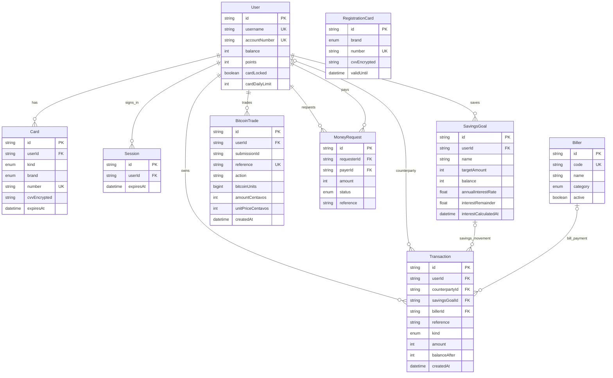

# Database guide

The database has nine tables. `User` holds the main PHP balance; the other tables record cards, savings, activity, requests and sign-in sessions.

This diagram shows the fields needed to explain the relationships. The complete field list is in [schema.prisma](../gobank/prisma/schema.prisma). `PK` means primary key, `FK` means foreign key and `UK` means a unique value.

## How the records connect

- A user has one physical card and one virtual card. Both spend from `User.balance` and share the user's lock and daily limit.
- A savings goal belongs to one user. Its transaction link is optional because most transactions are unrelated to savings.
- A transfer creates two transactions with the same reference: one negative amount for the sender and one positive amount for the recipient. `counterpartyId` identifies the other user.
- A money request stores the requester, payer, amount and status. Paying it creates a transfer; the request retains its reference.
- A Bitcoin trade belongs to a user. Its reference connects the trade to its PHP activity entry by value; it is not a foreign key.
- A registration card is a temporary reservation before a user exists. Successful registration moves its credentials to the user's physical card and removes the reservation.

Transactions are unique by `(reference, userId)`. Cards are unique by `(userId, kind)`, savings names by `(userId, name)` and Bitcoin submissions by `(userId, submissionId)`.

## Money and Bitcoin units

PHP values use whole centavos: **₱100.00 = 10,000 centavos**. This applies to balances, amounts, savings targets and card limits. Transaction amounts are signed: negative for money leaving the account and positive for money entering it.

Bitcoin quantities use whole units: **1 BTC = 100,000,000 units**, so 0.01 BTC is 1,000,000 units. The code calls this conversion `UNITS_PER_BITCOIN`. Keeping whole units avoids rounding errors when adding and subtracting Bitcoin.

| Bitcoin field       | Meaning                                                                  |
| ------------------- | ------------------------------------------------------------------------ |
| `action`            | `buy` or `sell`                                                          |
| `bitcoinUnits`      | Quantity of Bitcoin bought or sold, in whole units                       |
| `amountCentavos`    | PHP debited for a buy or credited for a sell, including the fee's effect |
| `unitPriceCentavos` | PHP price of one BTC at the time of the trade                            |
| `submissionId`      | Identifies one submission so retrying it cannot create a second trade    |
| `reference`         | Receipt reference shared with the PHP transaction                        |

There is no separate Bitcoin wallet table. The service calculates holdings from the trade history: buys add units and sells subtract units. PHP settlement still uses the user's main balance and the normal transaction ledger.

## Savings interest

`annualInterestRate` stores 0.04 for 4% per year. `interestCalculatedAt` records the last settled time, and `interestRemainder` carries fractions of a centavo into the next calculation. The credited balance remains whole centavos.

GoalSave is the name shown in the app; `SavingsGoal` is its database model. Existing `/stashes` URLs and the `stashes/` feature folder continue to serve that screen.
